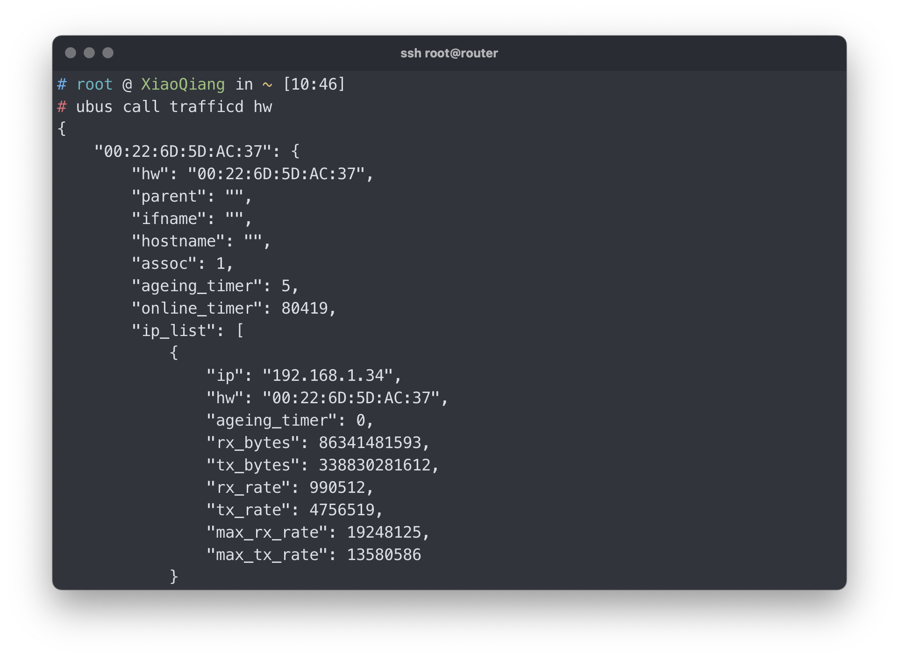
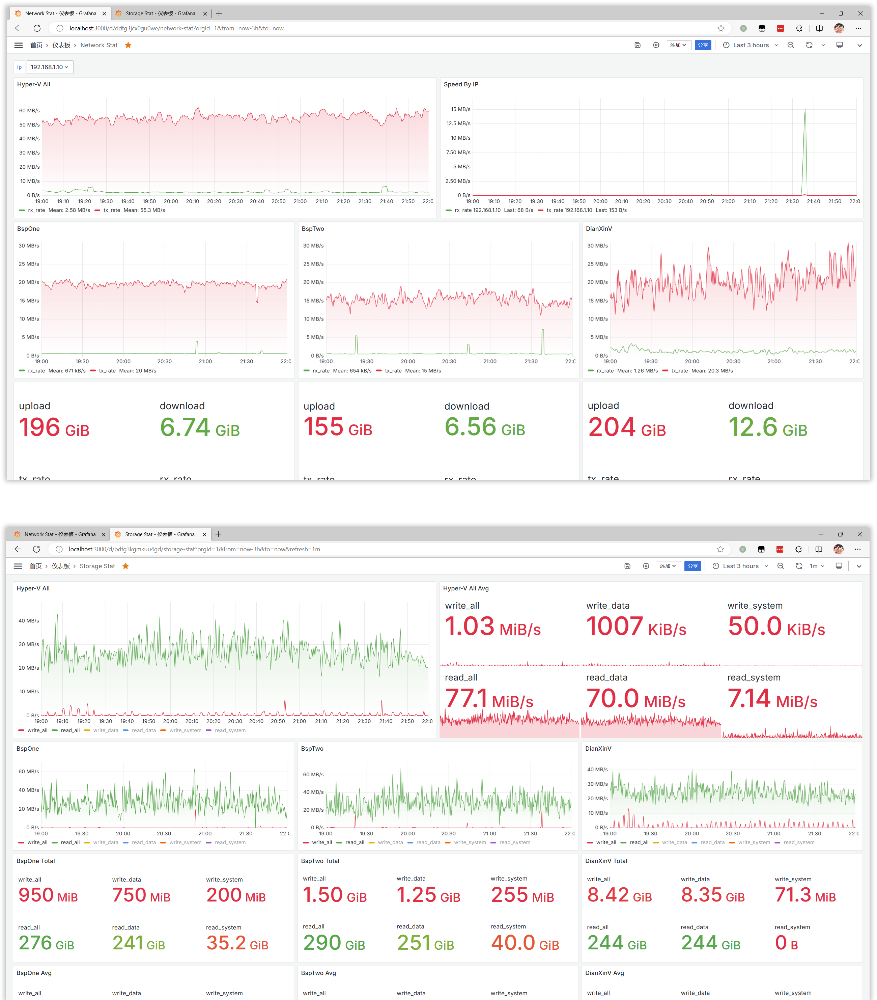

## 使用 MQTT / Python / Grafana 实现小米路由器网速查看与统计

[](https://www.python.org)

[小米 AX6000](https://www.mi.com/r6000) 路由器虽然身形巨大无比，但自带的网速查看功能却十分简陋，约等于没有。幸好系统是基于 OpenWrt 的，可以自己动手实现一个。

## Step 1: 寻找数据

### 命令：

```sh
ubus call trafficd hw '{"debug": true}'
```


简单的命令却寻觅最久，机缘巧合之下才发现... 使用时加入 `debug` 参数以获得更多信息。

<br>

## Step 2：加工处理

有了数据源就好做了，定时采样加工处理再展示即可。小米路由器自带了一部分 MQTT 工具，因此使用 MQTT 将数据源转发给电脑处理并入库，再使用 Grafana 做展示。即使电脑不一直开机也没关系，通过配置，MQTT broker 可持久化暂存未处理消息。

### 2.1 安装 [Mosquitto broker](https://mosquitto.org/) 2.0

小强系统自带了 MQTT client，只需安装支持 MQTT v5 的 broker 即可。手动下载 ipk 文件，解压后获得可执行文件（`.\data.tar.gz\.\usr\sbin\mosquitto`），将其上传到路由器中并注册为服务。如果 opkg 可用更佳。

`Cortex-A53`: [mosquitto-nossl_2.0.15-1_aarch64_cortex-a53.ipk](http://mirrors.aliyun.com/openwrt/releases/22.03-SNAPSHOT/packages/aarch64_cortex-a53/packages/mosquitto-nossl_2.0.15-1_aarch64_cortex-a53.ipk)

`更多`：https://mirrors.aliyun.com/openwrt/releases/22.03-SNAPSHOT/packages/

创建配置文件：

[/etc/mosquitto.conf](docs/mosquitto.conf):

```conf
# log_dest file /tmp/log/mosquitto.log
user root
bind_address 0.0.0.0
allow_anonymous true
```

[/etc/init.d/mosquitto-2](docs/mosquitto-2)

```sh
#!/bin/sh /etc/rc.common

START=50

start() {
    /data/cz/bin/mosquitto-2 -c /etc/mosquitto.conf -d
    return 0
}
```

### 2.2 定时采样

创建 `cron job` 实现定时采样，可结合 `sleep` 实现分钟内采样。

```sh
* * * * * ubus -S call trafficd hw '{"debug": true}' | mosquitto_pub -t 'home/router-stat' -q 2 -i client_pub -l -D publish user-property timestamp $(date +%s) >/dev/null 2>&1
```

### 2.3 [编写程序解析数据并入库](https://github.com/CaoZ/RouterStat)

使用 Python 编写 MQTT 消费者程序，解析数据并写入数据库。如果是 Windows 可以使用 [nssm](https://nssm.cc) 将其[注册为服务](docs/install.bat)。

配置在 [config.py](app/config.py) 中。

[创建所需表：](docs/schema.sql)

```sql
CREATE TABLE router_stat (
	id INTEGER NOT NULL AUTO_INCREMENT,
	ip VARCHAR(15),
	mac CHAR(17),
	network ENUM('2.4G','5G','Ethernet','Unknown'),
	device VARCHAR(255),
	rx_rate INTEGER,
	tx_rate INTEGER,
	timestamp DATETIME,
	PRIMARY KEY (id)
);
```

### 2.4 安装 [Grafana](https://grafana.com) 并创建监控面板

有了数据就可以用 Grafana 自由的创建监控面板了~

比如创建一个 `Time series` 面板来查看上传下载总速度：

```sql
select sum(rx_rate) as rx_rate, sum(tx_rate) as tx_rate, unix_timestamp(timestamp) as time from home.router_stat where $__timeFilter(timestamp) group by timestamp
```

## Screenshot:




